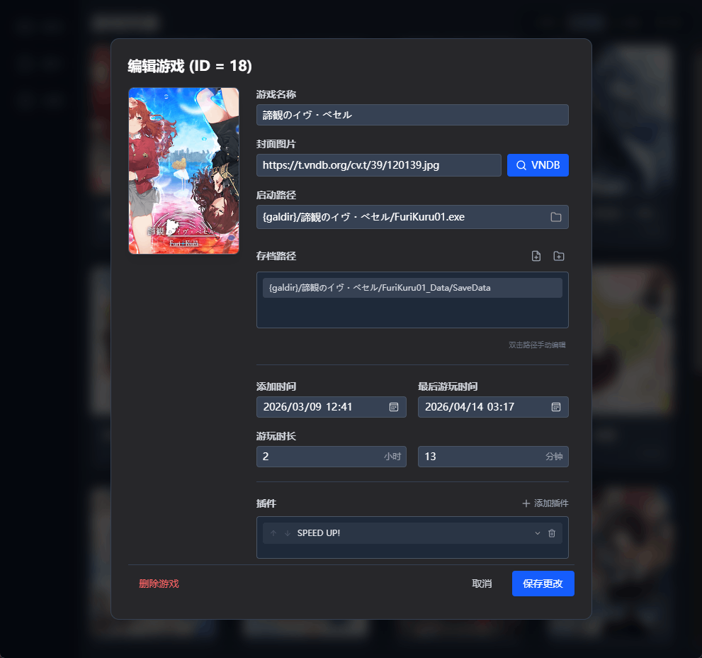
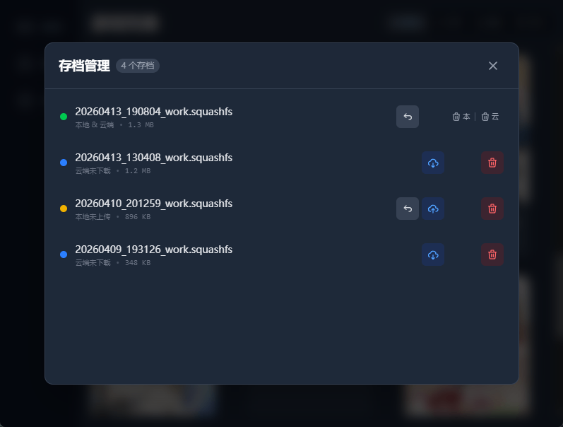
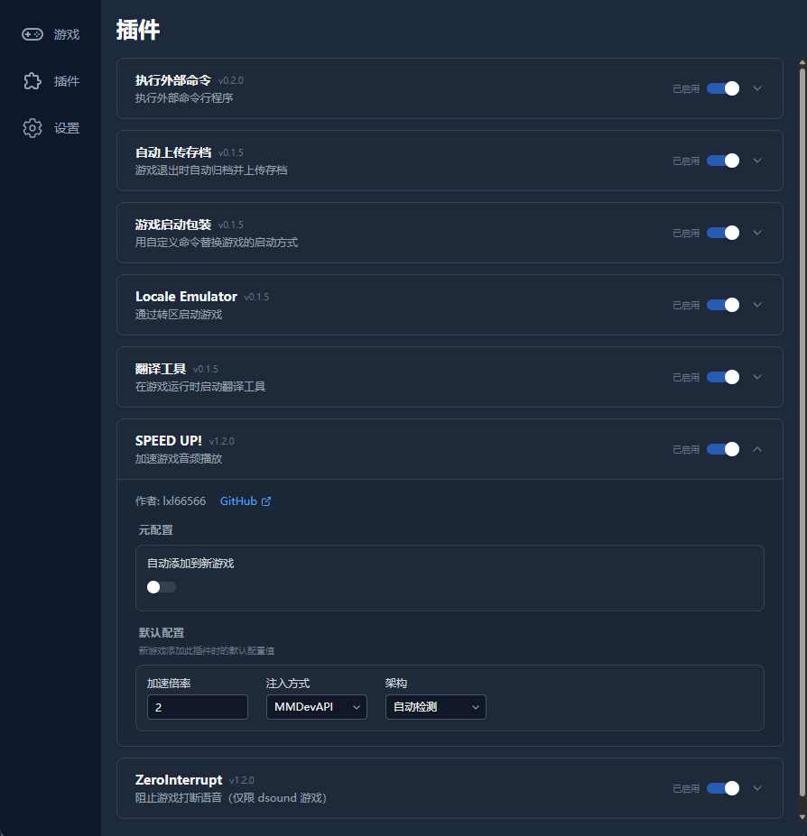

# GalgameManager

简体中文 | [English](./docs/README-en.md)

基于 Tauri + SolidJS 的游戏启动器，主要用于管理与游玩 Galgame。

它可以做到：

- 跨设备同步配置与存档
  - 当前支持本地路径、WebDAV 和 S3 作为存储后端（如果有其他后端需求，可以提 issue）
  - 高效的压缩算法（squashfs + zstd，可调压缩级别）
  - 通过自定义变量，支持不同设备上使用不同路径
  - 灵活的存档管理与恢复
- 强大的插件系统，自定义不同游戏的行为与附加功能
- 精确的游玩时长记录（可选：仅记录窗口焦点时长 或 运行时长）
- 日志系统（支持 diff）、每日快照，确保用户数据安全
- 多语言/亮暗主题支持

## Screenshots

## TODO

- [x] 存档备份与同步
- [x] 游玩时长记录
- [x] i18n
- [x] 插件系统与启动链
- [ ] 支持更多存储后端
- [ ] unix exec 优化

## Changelog

### unstable

- 修复：图片缓存未命中时无法显示

### v1.0.0

- （重大更新）**支持插件系统**：插件是开发者预定义的一系列功能，用户可将插件应用到游戏上，并修改参数以自定义游戏的附加功能。首批插件：
  - 执行外部命令
  - 自动上传存档
  - 游戏启动包装
  - Locale Emulator
  - 翻译工具
  - SPEED UP!（音频加速）
  - ZeroInterrupt（语音不中断）
- 支持 VNDB 搜图
- 支持自定义传输超时（IO timeout）和操作超时（non IO timeout）
- 支持右键菜单，可打开游戏目录
- 修复：更改游戏时长保留秒数与纳秒，防止时间精度丢失导致的自动上传失败

### v0.1.5

- 关键修复：配置同步逻辑修正
  - 相关修复：启动时重复写入配置、非预期更新 last_updated 时间戳
- 修复：图片无法缓存
- UI 优化：将图片加载失败视为次要错误
- 同步优化：上传支持超时与重试

### v0.1.4

- 修复：变量编辑器无法连续输入
- 修复：自动上传配置在游戏进行时失效
- 修复：运行本地不存在的游戏时显示报错信息
- 修复：备份失败时移除本地的 0KB 备份文件

### v0.1.3

- 修复：自动上传配置时远端配置不存在的相关逻辑与交互
- 修复：新设备无法首次拉取存档
- 修复：自动上传配置不生效
- 日志系统
- 同步界面显示文件大小
- 添加游戏时自动转换反斜杠
- interval 设为 0 禁用自动上传配置
- UI 优化：scroll bar，侧边栏禁止拖拽
- 交互优化：退出时上传配置失败后提醒用户
- 逻辑优化：快照改为 copy

### v0.1.2

- 修复：游戏 playing 状态在切换页面后丢失
- 支持更加精确的游玩时长记录（Windows only）
- 默认使用系统语言
- 支持游戏排序

### v0.1.1

- 关键修复：部分依赖 current directory 的游戏无法启动
- 修复：上次游玩时间前端不自动更新
- 修复：游戏删除时自动删除 local & remote 存档；游戏删除二次确认
- 自动恢复窗口大小/位置；防止重复启动
- 每日自动备份配置
- 扩大 i18n 覆盖范围
- 支持亮暗主题切换

### v0.1.0

- 存档备份与恢复、上传与下载
- 基于开始与结束时间的游玩时长记录，Windows 上可追踪游戏子进程
- 设备变量编辑与解析
- 图片下载与本地缓存
- 配置备份，支持定时上传、程序关闭时上传
- 启动时自动拉取最新配置，支持撤销
- 最小化到系统托盘
- i18n
